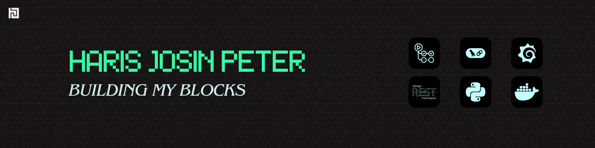

  

  
  
  

 

> Site Reliability and cloud-focused backend engineer with hands-on experience managing production-grade, containerized microservices in a product-based ERP environment. Skilled in incident handling, performance optimization, observability engineering, CI/CD automation, and infrastructure monitoring.

---

## 🛠️ Technical Skills

| Category | Stack |
|---|---|
| **Languages** | Python · JavaScript · Dart · C++ · Bash |
| **Cloud / DevOps** | Docker · Kubernetes (Minikube) · GitHub Actions · AWS (EC2, S3) · MinIO |
| **Observability** | Prometheus · Grafana · Node Exporter · cAdvisor · Loki · Promtail |
| **Databases** | PostgreSQL · MongoDB · ChromaDB |
| **Frameworks** | Django · DRF · Flutter · Streamlit |
| **Other** | Git · Linux · REST APIs · LangChain · Langflow · RAG |

---

## 💼 Experience

### Django Backend Developer — Caddayn *(Jan 2025 – Present)*

- Led backend architecture and DevOps operations as the **sole backend engineer**, managing a containerized microservices ERP with **5 production services** (Admin, ERP Backend, PostgreSQL, MinIO, Biller).
- Improved overall **system uptime by 10%** through proactive monitoring, alert configuration, and performance optimization.
- **Reduced deployment time by 10%** by optimizing CI/CD workflows with GitHub Actions and Docker-based production releases.
- **Decreased PostgreSQL backup failure rate by 80%** by implementing automated backup validation and S3-compatible (MinIO) recovery pipelines.
- Designed and deployed a full **observability stack** (Prometheus, Grafana, Node Exporter, cAdvisor, Loki, Promtail) for real-time container and system-level monitoring.
- Configured automated alerts for high CPU/memory usage, significantly reducing incident detection time.
- **Optimized the ERP billing module** using Django bulk create — reduced response time from 10–13s to 3–5s (**60% improvement**).
- Resolved a critical release failure caused by inefficient Elasticsearch indexing by removing the dependency entirely, stabilizing deployments.
- Implemented cron-based health checks integrated with **Cloudflare Zero Trust tunnels** for secure remote access and automated downtime alerts.

### Flutter Intern — Caddayn *(Aug 2023 – Jun 2024)*

- Developed cross-platform mobile apps with Flutter, implementing state management, API integration, and UI animations.

---

## � Projects

### 🏆 [LawLens AI](https://github.com/Joeljaison391/LawLens-AI) — *Winner, BeachHack Season 6 (2025)*
Regulatory document review engine using **RAG, ChromaDB, and Mistral 7B**. Enables compliance verification of legal documents through natural language reasoning and similarity search.

### 🔗 [Orion](https://github.com/parthavpovil/orion-web) — *Decentralized Academic Review System (2025)*
Peer-review platform using **IPFS, MetaMask, and Ethereum smart contracts**, with AI-driven pre-review and plagiarism analysis via NLP.

### 🧠 [SoulSync](https://github.com/JoelJaison394/SoulSync) — *AI Companion for Alzheimer's Patients (2025)*
Personalized NLP-based chatbot combining reminiscence therapy principles with user-specific interaction modeling for memory recall and emotional engagement.

---

## 🏅 Awards & Honors

- 🥈 **2026** — 1st Runner-up, Global Game Jam
- 🥇 **2025** — 1st Prize, BeachHack Season 6
- 🎙️ **2024–25** — Outreach Lead, TinkerHub SCET
- 🥇 **2024** — 1st Prize, Infinia Hackathon

---

## � Certifications

- **AI Agents 101: Building AI Agents with MCP and Open-Source Inference** — AMD (Feb 2026)
- **Backend Development and APIs** — FreeCodeCamp (Dec 2024)
- **Building an AI-Powered Game!** — DeepLearning.AI (Nov 2024)
- **Google AI Essentials** — Coursera (Jun 2024)

---

## 🎓 Education

**B.Tech CSE** — Sahrdaya College of Engineering and Technology, Kodakara · CGPA: 7.94 *(2025)*

---

## 📊 Contribution Activity

  

